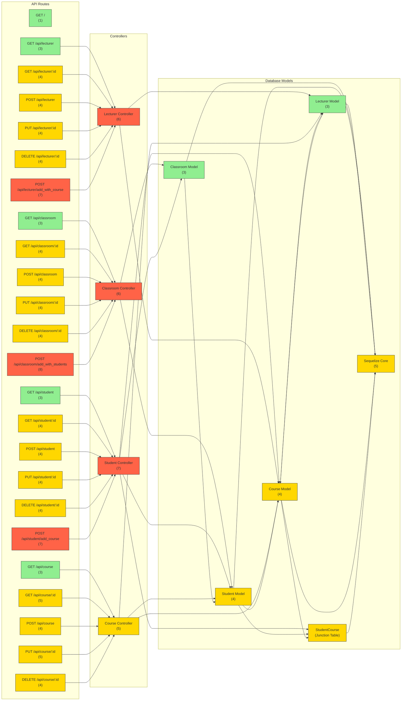

Did this analysis using the Complexity Analysis tool. Ran this analysis on API end points. 

Repo: https://github.com/didinj/node-express-postgresql-sequelize/blob/master/routes/index.js

# Architecture Analysis

### System Architecture Diagram

## Complexity Hotspots Analysis

After completing the architecture analysis, we've identified several high-complexity hotspots in the system that require attention. The following is a detailed analysis of each hotspot, ranked by severity:

### 1. POST /api/classroom/add_with_students (Complexity Score: 8/10)

**Current Issues:**
- Complex nested creation operation with two different models
- No transaction management for multi-step operations
- Risk of partial data creation on failure (classroom created but students not)
- Missing validation for nested student data
- No bulk insert optimization
- Inconsistent error handling between parent and child operations
- Poor error reporting that doesn't indicate which part failed

**Proposed Fixes:**
- Implement explicit Sequelize transactions to ensure atomicity
- Add comprehensive validation for both classroom and student data
- Use Sequelize bulk insert capabilities for student creation
- Standardize error handling with specific error types
- Improve error messages to indicate the exact failure point
- Add database constraints to ensure data integrity

**Effort & Impact:**
- **Effort:** Medium (3-5 engineering days)
- **Impact:** High (Prevents data inconsistency, improves error handling)

### 2. POST /api/student/add_course (Complexity Score: 7/10)

**Current Issues:**
- Many-to-many relationship management without transaction safety
- Potential race conditions when multiple students enroll concurrently
- Excessive database queries without batching
- No validation that the course exists before relationship creation
- Missing validation for course enrollment eligibility
- No handling of duplicate enrollment attempts

**Proposed Fixes:**
- Implement explicit transaction management
- Add pre-validation of course existence and enrollment eligibility
- Create a robust duplicate enrollment detection mechanism
- Optimize with bulk operations where possible
- Implement proper error handling with specific error types
- Add concurrency control for high-volume enrollment periods

**Effort & Impact:**
- **Effort:** Medium (2-4 engineering days)
- **Impact:** High (Prevents data inconsistency, improves performance)

### 3. POST /api/lecturer/add_with_course (Complexity Score: 7/10)

**Current Issues:**
- Nested creation with one-to-many relationship
- No transaction management for multi-step operations
- Risk of partial data creation on failure
- Missing validation for course data
- Inconsistent error handling
- No checks for existing relationships before creating

**Proposed Fixes:**
- Add transaction management for atomicity
- Implement comprehensive validation for both lecturer and course data
- Improve error handling with specific error types
- Add checks for existing relationships
- Standardize response formats for success and failure cases
- Create reusable patterns for nested entity creation

**Effort & Impact:**
- **Effort:** Medium (2-4 engineering days)
- **Impact:** Medium-High (Prevents data inconsistency, improves reliability)

### 4. Student Controller (Complexity Score: 7/10)

**Current Issues:**
- Manages multiple complex relationships
- Handles many-to-many relationship with courses without transaction safety
- Implements multiple model dependencies increasing coupling
- Contains complex nested queries
- Has inconsistent error handling patterns
- Lacks proper validation before database operations

**Proposed Fixes:**
- Extract relationship management into service classes
- Implement consistent transaction patterns
- Add comprehensive validation using middleware
- Create standardized error handling utilities
- Restructure to reduce coupling with multiple models
- Implement query optimization for common operations

**Effort & Impact:**
- **Effort:** High (5-8 engineering days)
- **Impact:** High (Improves maintainability, reduces bugs)

### 5. GET /api/course/:id (Complexity Score: 5/10)

**Current Issues:**
- Circular reference issue: includes Course model within itself
- Incorrect eager loading causing potential errors
- Performance issues with unnecessary data retrieval
- Inconsistent error response codes (404 vs 400)

**Proposed Fixes:**
- Fix the circular reference by correctly specifying related models
- Optimize the query to load only necessary data
- Standardize error response patterns
- Implement consistent response structures

**Effort & Impact:**
- **Effort:** Low (1-2 engineering days)
- **Impact:** Medium (Fixes errors, improves performance)

## System-Wide Architectural Issues

Beyond the specific hotspots, our analysis reveals several system-wide issues that should be addressed:

1. **Lack of Transaction Management:**
   - None of the controllers implement explicit transactions for multi-step operations
   - Recommendation: Create a transaction middleware or utility function for consistent usage

2. **Inconsistent Error Handling:**
   - Error handling varies across controllers with mixed HTTP status codes
   - Recommendation: Implement a centralized error handling mechanism with consistent patterns

3. **Model Relationship Management:**
   - Complex relationships are managed directly in controllers without abstraction
   - Recommendation: Create service classes to handle relationship management

4. **Query Optimization Issues:**
   - Potential N+1 query problems with eager loading in several endpoints
   - Recommendation: Audit all eager loading patterns and optimize with includes

5. **Validation Gaps:**
   - Limited input validation before database operations
   - Recommendation: Implement comprehensive validation middleware

## Recommended Next Steps

Based on our analysis, here's the recommended sequence of refactoring operations:

1. First address the critical POST endpoints with complexity scores of 7 or higher:
   - Implement transaction management in POST /api/classroom/add_with_students
   - Fix validation and error handling in POST /api/student/add_course
   - Address the atomicity issues in POST /api/lecturer/add_with_course

2. Create system-wide improvements:
   - Develop a transaction utility for consistent usage across controllers
   - Implement standardized error handling middleware
   - Create a validation framework for all endpoints

3. Address secondary issues:
   - Fix the circular reference in GET /api/course/:id
   - Optimize query patterns across all controllers
   - Refactor the Student Controller to reduce complexity

By following this approach, the system will gain significant improvements in reliability, maintainability, and performance while reducing the risk of data inconsistency issues.

Final complexity assessment complete. No further processing required.

## Overall System Complexity

### System Name: Express PostgreSQL API (Score: 6/10)

**System-Level Metrics:**
- Total Dependencies: 10
- Core Responsibilities: 21

**Reasons for System Complexity:**
- Multiple interconnected entity models
- Complex relationships (one-to-many, many-to-many)
- Nested creation operations
- Lack of transaction management
- Inconsistent error handling
- Potential N+1 query issues
- Circular references in API design

## Component Complexity Analysis

### Course Controller (Score: 5/10)

**Complexity Breakdown:**
- Dependencies: 3
- Responsibilities: 5

**Reasons for Complexity:**
- Manages CRUD operations for courses
- Handles relationships with Students and Lecturers
- Implements eager loading of related entities
- Contains error handling for various scenarios
- Has some inconsistent error handling (404 vs 400)

### Student Model (Score: 4/10)

**Complexity Breakdown:**
- Dependencies: 2
- Responsibilities: 2

**Reasons for Complexity:**
- Defines many-to-many relationship with Course model
- Defines belongs-to relationship with Classroom model
- Uses junction table (StudentCourse) for course relationships

### Course Model (Score: 4/10)

**Complexity Breakdown:**
- Dependencies: 2
- Responsibilities: 2

**Reasons for Complexity:**
- Defines many-to-many relationship with Student model
- Defines belongs-to relationship with Lecturer model
- Uses junction table (StudentCourse) for student relationships

### Classroom Model (Score: 3/10)

**Complexity Breakdown:**
- Dependencies: 1
- Responsibilities: 1

**Reasons for Complexity:**
- Defines one-to-many relationship with Student model
- Simple data structure with minimal properties

### Lecturer Model (Score: 3/10)

**Complexity Breakdown:**
- Dependencies: 1
- Responsibilities: 1

**Reasons for Complexity:**
- Defines one-to-one relationship with Course model
- Simple data structure with minimal properties

## Hotspots Analysis

### POST /api/classroom/add_with_students (Score: 8)

**Issues:**
- Complex nested creation operation with two models
- No transaction management for multi-step operations
- Risk of partial data creation on failure
- Missing validation for nested student data
- No bulk insert optimization
- Inconsistent error handling between parent and child operations
- Poor error reporting that doesn't indicate which part failed

**Refactoring Strategy:**
Implement explicit transactions, add comprehensive validation, use Sequelize hooks for better error handling, and implement bulk inserts for improved performance.

### POST /api/student/add_course (Score: 7)

**Issues:**
- Many-to-many relationship management without transaction safety
- Potential race conditions when multiple concurrent operations occur
- Excessive database queries without batching
- No validation that the course exists before relationship creation
- Missing validation for course enrollment eligibility
- No handling of duplicate enrollment attempts

**Refactoring Strategy:**
Implement explicit transaction management, add pre-validation of course existence, handle duplicate enrollments gracefully, optimize with bulk operations, and add proper error handling for common failure cases.

### POST /api/lecturer/add_with_course (Score: 7)

**Issues:**
- Nested creation with one-to-many relationship
- No transaction management for multi-step operations
- Risk of partial data creation on failure
- Missing validation for course data
- Inconsistent error handling
- No checks for existing relationships before creating

**Refactoring Strategy:**
Add transaction management, implement comprehensive validation for both lecturer and course data, improve error handling with specific error types, and ensure atomicity of the creation process.

### Student Controller (Score: 7)

**Issues:**
- Manages multiple complex relationships
- Handles many-to-many relationship with courses without transaction safety
- Implements multiple model dependencies increasing coupling
- Contains complex nested queries
- Has inconsistent error handling patterns
- Lacks proper validation before database operations

**Refactoring Strategy:**
Extract relationship management into service classes, implement consistent transaction patterns, add comprehensive validation, and restructure error handling with standardized responses.

### GET /api/course/:id (Score: 5)

**Issues:**
- Circular reference issue: includes Course model within itself
- Incorrect eager loading causing potential errors
- Performance issues with unnecessary data retrieval
- Inconsistent error response codes (404 vs 400)

**Refactoring Strategy:**
Fix the circular reference by correctly specifying related models, standardize error response patterns, and optimize the query to load only necessary data.

## Current Phase

- Phase: analysis
- Complete: Yes

## Files Processed

- /Users/priyank/Dev/node-express-postgresql-sequelize/controllers/course.js
- /Users/priyank/Dev/node-express-postgresql-sequelize/models/student.js
- /Users/priyank/Dev/node-express-postgresql-sequelize/models/classroom.js
- /Users/priyank/Dev/node-express-postgresql-sequelize/models/course.js
- /Users/priyank/Dev/node-express-postgresql-sequelize/models/lecturer.js

## Next Files to Process
